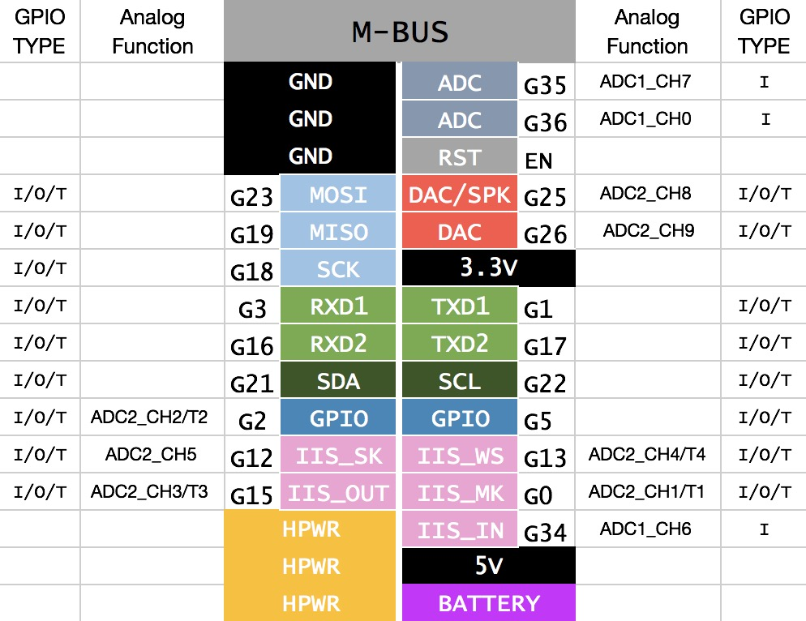

# Cubic32 Library

English | [中文](docs/getting_started_cn.md) | [日本語](docs/getting_started_ja.md)

Welcome to program with Cubic32 Core

## 1. Get Started

#### Here is the article to get started

*1.For MacOS*

Coming soon...

*2. For Windows*

Coming soon...

*3. For VSCode in Windows*

Coming soon...

## 2. Example

https://github.com/Afantor/Cubic32/tree/master/examples

## 3. API Reference

https://github.com/Afantor/Cubic32/blob/master/src/Cubic32.h#L19

## 4. H/W Reference

#### Pinout

*We have several kinds of ESP32 Cores, There is [their difference in schematic](https://github.com/m5stack/M5-Schematic/blob/master/Core/hardware_difference_between_cores.md).*

**LCD**

*LCD Resolution: 320x240*

<table>
 <tr><td>ESP32 Chip</td><td>GPIO13</td><td>GPIO14</td><td>GPIO15</td><td>GPIO2</td><td>GPIO27</td><td>GPIO4</td></tr>
 <tr><td>ILI9341</td><td>MOSI</td><td>CLK</td><td>CS</td><td>DC</td><td>RST</td><td>BLK</td></tr>

</table>

**Touch & TF Card**

<table>
 <tr><td>ESP32 Chip</td><td>GPIO23</td><td>GPIO19</td><td>GPIO18</td><td>GPIO32</td><td>GPIO33</td><td>GPIO5</td></tr>
 <tr><td>XPT2046</td><td>MOSI</td><td>MISO</td><td>CLK</td><td>CS</td><td>IRQ</td></tr>
 <tr><td>TF Card</td><td>MOSI</td><td>MISO</td><td>CLK</td><td> </td><td> </td><td>CS</td></tr>

</table>

**Button & Speaker**

<table>
 <tr><td>ESP32 Chip</td><td>GPIO0</td><td>GPIO39</td><td>GPIO25</td></tr>
 <tr><td>Button Pin</td><td>BUTTON R</td><td>BUTTON A/B/C</td><td> </td></tr>
 <tr><td>Speaker</td><td> </td><td> </td><td>Speaker Pin</td></tr>
</table>

**IMU & RTC & Temp/Hum**

<table>
 <tr><td>ESP32 Chip</td><td>GPIO22</td><td>GPIO21</td><td>Address</td></tr>
 <tr><td>MPU6050</td><td>SCL</td><td>SDA</td><td>0x68</td></tr>
 <tr><td>PCF8563T</td><td>SCL</td><td>SDA</td><td>0x38</td></tr>
 <tr><td>AHT10</td><td>SCL</td><td>SDA</td><td>0xA3</td></tr>
</table>

### M-BUS

## 5. M5stack USER CASES

* [M5Stack-SD-Updater](https://github.com/tobozo/M5Stack-SD-Updater) - Customizable menu system for M5Stack - loads apps from the Micro SD
  card

* [TFT_eSPI](https://github.com/Bodmer/TFT_eSPI)  - TFT library for the ESP8266 and ESP32 that supports different driver chips

* [M5Widgets](https://github.com/Kongduino/M5Widgets) - Widgets for the M5Stack

* [M5StackSAM](https://github.com/tomsuch/M5StackSAM) - Simple Applications Menu Arduino Library for M5Stack

* [cfGUI](https://github.com/JF002/cfGUI) - A simple GUI library for M5Stack (ESP32)

* [GUIslice](https://github.com/ImpulseAdventure/GUIslice) - A lightweight GUI framework suitable for embedded displays

* [M5ez](https://github.com/ropg/M5ez) - The easy way to program on the M5Stack

* [M5Stack MultiApp Advanced](https://github.com/botofancalin/M5Stack-MultiApp-Advanced) - A M5Stack firmware made on PlatformIO

* [M5Stack ESP32 Oscilloscope](https://github.com/botofancalin/M5Stack-ESP32-Oscilloscope) - A fully functional oscilloscope based on ESP32 M5Stack

* [M5Stack-Avatar](https://github.com/meganetaaan/m5stack-avatar) - An M5Stack library for rendering avatar faces

* [M5Stack_CrackScreen](https://github.com/nomolk/M5Stack_CrackScreen) - Crack your M5Stack!!

* [M5_Shuttle_Run](https://github.com/n0bisuke/M5_Shuttle_Run) - M5_Shuttle_Run

* [nixietubeM5](https://github.com/drayde/nixietubeM5) - (Fake) Nixie Tube Display on a M5Stack

* [M5Stack_BTCTicker](https://github.com/dankelley2/M5Stack_BTCTicker) - A small Bitcoin price ticker using an M5Stack (ESP32) and the Coindesk API

* [M5Stack_ETHPrice](https://github.com/donma/M5StackWifiSettingWithETHPrice) - Dependence on example Wifi Setting to get ETH Price from Maicoin

* [M5Stack-PacketMonitor](https://github.com/tobozo/M5Stack-PacketMonitor) - M5Stack ESP32 Packet Monitor

* [M5-FFT](https://github.com/ElectroMagus/M5-FFT) - Graphic Equalizer on the M5Stack platform

* [M5Stack_ESP32_radio](https://github.com/anton-b/M5Stack_ESP32_radio) - Playing mp3 stream out of internet using M5Stack prototype

* [mp3-player-m5stack](https://github.com/dsiberia9s/mp3-player-m5stack) - MP3 player for M5Stack

* [ArduinoWiFiPhotoBackup](https://github.com/moononournation/ArduinoWiFiPhotoBackup) - M5STACK Arduino WiFi Photo Backup device

* [M5StackHIDCtrlAltDel](https://github.com/mhama/M5StackHIDCtrlAltDel) - You can send ctrl+alt+del to your PC from M5Stack

* [M5Stack Markdown Web Server](https://github.com/PartsandCircuits/M5Stack-MarkdownWebServer) - Markdown & icons loaded from an Micro SD card/TF card to run a web page

* [M5Stack-Tetris](https://github.com/PartsandCircuits/M5Stack-Tetris) - Tetris for M5Stack Ported to M5Stack by macsbug - https://macsbug.wordpress.com/

* [M5Stack_FlappyBird_game](https://github.com/pcelli85/M5Stack_FlappyBird_game) - M5Stack FlappyBird Playable

* [M5Stack-SpaceShooter](https://github.com/PartsandCircuits/M5Stack-SpaceShooter) - Space Invaders knock-off for M5Stack

* [M5Stack-Pacman-JoyPSP](https://github.com/tobozo/M5Stack-Pacman-JoyPSP) - Pacman on M5Stack/PSP Joypad, with sounds

* [M5Stack-Thermal-Camera](https://github.com/hkoffer/M5Stack-Thermal-Camera-) - M5Stack Thermal Camera with AMG8833 thermal sensor

* [M5Stack-3DPrintFiles](https://github.com/PartsandCircuits/M5Stack-3DPrintFiles) - Links to files for 3D printing custom case parts for the M5Stack

* [truetype2gfx](https://github.com/ropg/truetype2gfx) - Converting fonts from TrueType to Adafruit GFX

* [m5stack-onscreen-keyboard](https://github.com/yellowelise/m5stack-onscreen-keyboard) - Full size qwerty keyboard for M5Stack

#### Note:

* How to install USB driver for establishing serial port

  https://docs.m5stack.com/#/en/related_documents/establish_serial_connection

* How to upgrade Cubic32 Libary

  https://docs.m5stack.com/#/en/related_documents/upgrade_m5stack_lib
